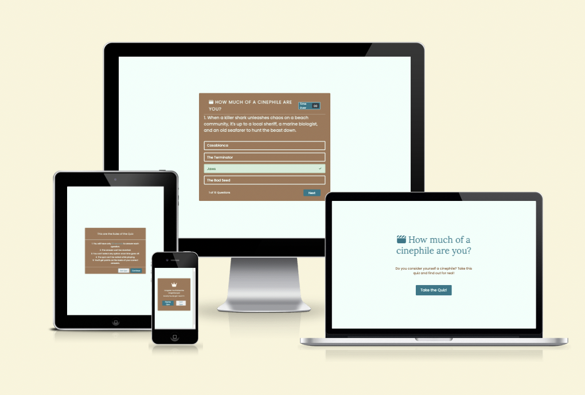
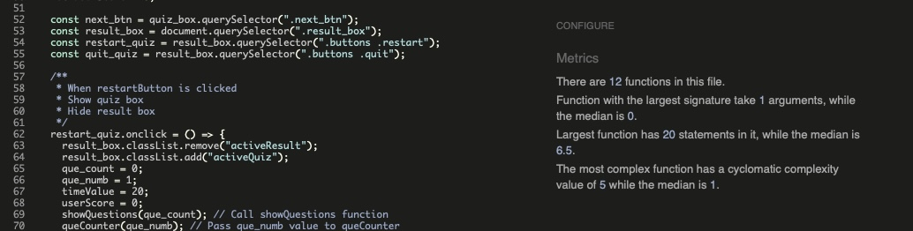
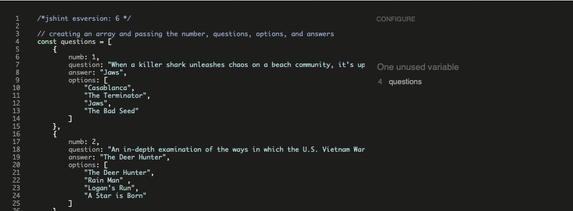
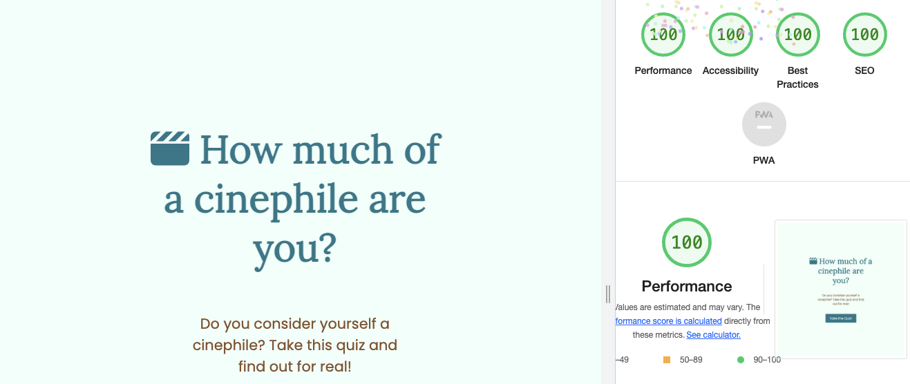
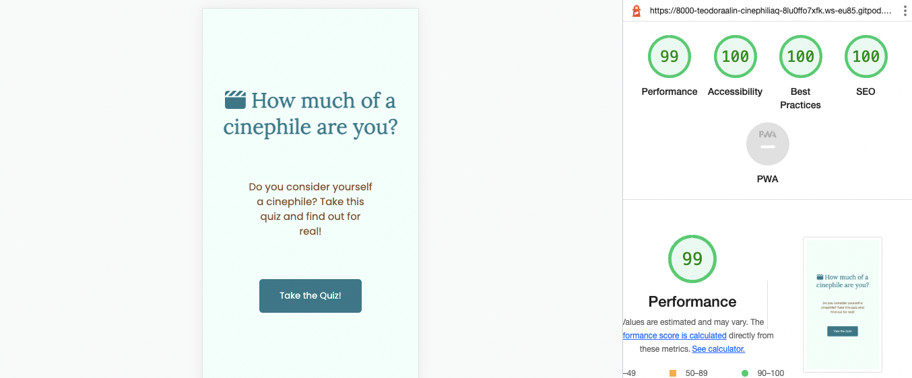

# Cinephilia Quiz
## Milestone Project Two

Cinephilia is an online quiz game made for people that have a special kind of love for movies. The user has 10 questions with 4 different options to choose from. The user has only 20 seconds to answer each question. The time is shown in the upper right corner of the quiz. If time has passed then the correct answer will be automatically be selected. If the option selected was wrong, then the correct option will be shown as well. A question counter is shown in the bottom left corner of the quiz so that the user can find out how many questions are left. In the end of the quiz, The score of the user will apear. The user has the option to replay or to quit the quiz.

## Demo 

You can view the live website here - [Cinephilia Quiz](https://teodoraalina.github.io/cinephilia-quiz)

You can view the GitHub repository here - [TeodoraAlina/cinephilia-quiz](https://github.com/TeodoraAlina/cinephilia-quiz)

***

## User Experience (UX)

### Strategy

### User Stories

As a user I want to be able to :
* Easily determine the purpose of the website.
* Enter the quiz without any problem.
* Understand each question.
* See how many questions I have left.
* See a timer to indicate how much time is left to enter an answer.
* Get feedback on whether or not the correct answer has been entered.
* See the correct answer if the option choosen was incorrect.
* At the end of the game get feedback on score.
* Navigate easily between the game screens.

## Structure

 The game will consist of :
  * A homepage which will contain the title of the quiz, a message to intrigue the user and a button which will present the user the rules of the quiz.
  * An info box with the rules of the game, a button to continue to the quiz game and a button to exit.
  * A quiz box that will contain the questions and answer, a timer and a next button.
  * A score box containing the score of the user, a button to replay the quiz and a button to quiz the quiz.

## Skeleton
* Desktop Wireframes - [Homepage](readme-images/quiz-homepage-desktop.png)/[Rules](readme-images/quiz-rules-desktop.png)/[Quiz](readme-images/quiz-box-desktop.png), [Result](readme-images/quiz-result-desktop.png),

* Mobile Wireframes - [Homepage](readme-images/quiz-homepage-mobile.png), [Rules](readme-images/quiz-rules-mobile.png), [Quiz](readme-images/quiz-box-mobilie.png), [Result](readme-images/quiz-result-mobile.png)

## Surface

### Colour
Three primary colours were used on the website. #F0FFFA was used for the background for the contrast. #a0785a was used for the background of the boxes, #257889 was used for the fonts. The pallete was taken from [Coolors](https://coolors.co/).

### Typography
[Google Fonts](https://fonts.google.com/) were used to import the "Lora" and "Poppins" fonts. "Lora" was used for the headers and "Poppins" for the content. The fonts were chosen because they work very well together and for the redability.

### Call to Action
* The "Take the Quiz" button sends the user to the Rules of the quiz, from where you can exit the quiz or continue.
* The "Continue" button opens the quiz game for the user.
* The "Next" button gets the user the next question until the questions are finished.
*  The buttons have a nice Malachite green color that goes perfectly with the Light mint color but also with the earthy brown. The colors of the buttons switch when hovered over.
* The
* When hovered over them, the options are highlighted with the mint color for the background and the Malachite green for the border, the text color goes from light mint to the Malachite green.
* When the option selected is correct, the option turns to green and a check icon appears in the right side.
* When the option selected is incorrect, the option turn to red and a "x" icon appears in the right side.
* If no option is selected when the time is over, the correct answer will appear highlighted with green colors as well as the check icon.
* When the quiz is completed, the result appear for the user to see. Three different messages are provided for different scores. Two buttons are provided: the "Replay Quiz" button and the "Quit Quiz" button, that give the user the chance to replay the quiz or quit it.

### Features to Implement in future
* The user to be able to enter a username.
* A score board at the and of the quiz.
* Random questions - to make the quiz more interactive.

# Technologies Used
* HTML5 - Mark-up language using semantic structure.
* CSS3 - Cascading style sheet used for styling.
* Gitpod.io - For writing the code, using the command line for commiting and pushing to GitHub.
* GitHub - Used to host the repository.
* Git - Used for version control of the project.

* [Google fonts](https://fonts.google.com/) - For styling the typography.
* [Balsamiq wireframe](https://balsamiq.cloud/) - To build wireframes in the design phase.
* [Font Awesome](https://fontawesome.com/) - For the icon presented next to the title, the icons used for the correct and incorrect answer and for the favicon.
* [Beautifier](https://beautifier.io) - To beautify HTML and CSS code.
* [Prettier](https://prettier.io/) - To beautify Javascript code.
* [JsHint](https://jshint.com) - Testing validity of JavaScript.
* [HTML Validator](https://validator.w3.org/#validate_by_input) - Testing validity of HTML.
* [CSS Validator](https://jigsaw.w3.org/css-validator/) - Testing validity of CSS.
* [Am I Responsive](https://ui.dev/amiresponsive#) - Checking the responsive nature and creating the mock-ups provided.
* DEV Tools - Lighthouse.
***

## Testing

### Validator Testing

* HTML Validator

* CSS Validator

* Javascript Validator for script.js file

* Javascript Validator for questions.js file

The reason for the unused variable "questions" message is that the questions.js file holds the game data in a separate file to the rest of the site code.
Please note that when running this test I set an option so the test wouldn't give a false alert for ECMAScript 6 specific syntax.

### Performance Testing

I have tested using the Developer Tools Lighthouse for desktop and mobile:

### Desktop

### Mobile

### Browser Compatibility

I have tested my website on the following:
* Google Chrome Version 108.0.5359.71 (desktop and mobile);
* Safari (desktop and mobile);
* Mozila Firefox Version 109.0.1(desktop and mobile).

### OS Compatibility

Tested on iOS 16.3, macOS Monterey 12.6.3 and Android 11. Tested for responsiveness using Chrome DevTools.

